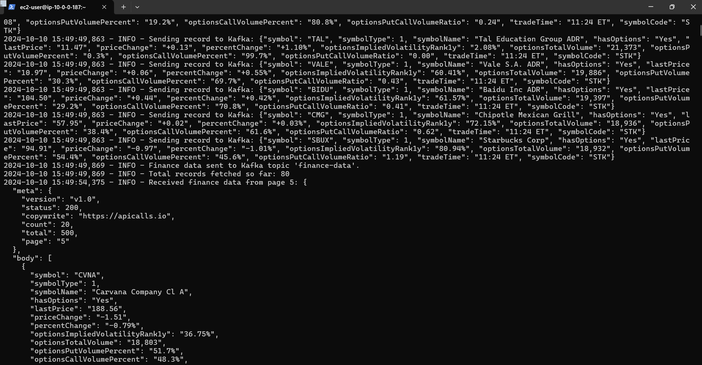

# Real-Time Data Pipeline with AWS MSK, Glue, and Athena
## Shahid Salim

### RapidAPI Financial Data Stream to Amazon Athena

This project involves creating a real-time data pipeline that ingests financial market data from a public API, processes it with Amazon Managed Streaming for Apache Kafka (MSK), stores the data in Amazon S3, and visualizes the data using AWS Glue and Amazon Athena. The goal is to build an end-to-end data pipeline that facilitates data ingestion, processing, and querying with serverless technologies in AWS.

# Table of Contents

- [Overview](#overview)
- [Components](#components)
- [Installation](#installation)
- [Terraform Infrastructure](#terraform-infrastructure)
- [Python Kafka Producer](#python-kafka-producer)
- [S3 Sink Connector](#s3-sink-connector)
- [AWS Glue Crawler and Athena Setup](#awsgluecrawaler-and-athena-setup)
- [Run the Data Pipeline](#run-the-datapipeline)
- [Conclusion](#Conclusion)

# Overview

The pipeline is built to achieve the following steps:

- Fetching financial stock data from a RapidAPI endpoint.
- Streaming the data into Amazon MSK (Kafka).
- Persisting the streaming data into Amazon S3 using Kafka Connect.
- Using AWS Glue to crawl the data in S3 and build a table schema.
- Querying the data with Amazon Athena for analysis and visualization.

# Components

The project primarily consists of:

- Terraform Infrastructure: To automate the provisioning of AWS resources (VPC, MSK Cluster, S3 Bucket, Glue, Athena).
- Python Kafka Producer: Script to fetch and send financial data from an API to the Kafka topic.
- S3 Sink Connector: To stream data from MSK to S3.
- Glue Crawler and Athena Query: To create a schema for the data stored in S3 and facilitate querying with Athena.


# Installation
1. Prerequisites:
    - AWS CLI installed and configured with the appropriate credentials.
    - Terraform installed on your machine.
    - Python and pip installed.
    - Libraries for Python script (specified in requirements.txt).

2. Install Python Dependencies: Before running the Python Kafka producer, ensure the required packages are installed by running:
    ```bash
    pip install -r requirements.txt
    ``` 


# Terraform Infrastructure
   - A VPC with required subnets for MSK.
   - An MSK Cluster for Kafka streaming.
   - An S3 Bucket for persisting Kafka data.
   - An IAM Role and Policy for AWS Glue.
   - An AWS Glue Crawler to create a table schema for the S3 data.
   - An Athena Database and Named Query for querying data. 

Usage
1. Initialize Terraform:
    ```bash
    terraform init
    ``` 
2. Apply Terraform Configuration:
    ```bash
    terraform apply -auto-approve
    ```


### Python Kafka Producer:
Overview
- A Python script fetches financial data from RapidAPI and streams it to the Kafka topic hosted on MSK.

Usage
1. Run the Python Script:
    ```bash
    python3 python_kafka_stocks.py
    ```
The script dynamically loads Kafka bootstrap servers from the Terraform output (kafka_brokers.json) and streams the data.




Libraries Used
   - requests: For API calls to RapidAPI.
   - kafka-python: For Kafka producer and topic management.
   - json, logging, time, os: Utility libraries.


### S3 Sink Connector
The Kafka Connect S3 Sink Connector is configured to stream data from the Kafka topic to an S3 bucket.

Usage
1. Run the Kafka Connect Standalone:
    ```bash
    cd kafka_2.12-3.5.1/
    bin/connect-standalone.sh config/connect-standalone.properties /home/ec2-user/s3-sink.properties
    ```


### AWS Glue Crawler and Athena Setup
AWS Glue is used to scan the data in S3 and build a schema. Athena is then configured to query this data.

Key Terraform Components:
1. Glue Crawler: The Terraform code provisions a Glue Crawler that scans the S3 bucket (kafkatos3than) and creates a table schema for the JSON data stored in the bucket.
2. Athena Setup:
    - The Terraform code creates an Athena Database (finance_data_athena_db) and an Athena named query to define the table schema based on the data format in S3.
    - The named query is designed to be used for running SQL-like queries on the data using Amazon Athena.


### Run the Data Pipeline

1. Terraform Deployment: Run Terraform to provision all resources.
2. Python Kafka Producer: Stream data from RapidAPI to MSK.
3. S3 Sink Connector: Start Kafka Connect to stream data from MSK to S3.
4. Glue Crawler: Run the Glue crawler to scan the S3 bucket.
5. Athena Query: Use Athena to query and visualize the data.


### Conclusion
This project demonstrates how to build a real-time data pipeline using AWS services like MSK, S3, Glue, and Athena, enabling streaming and querying of financial market data. The pipeline is easily scalable and provides a serverless architecture for handling and analyzing streaming data.

